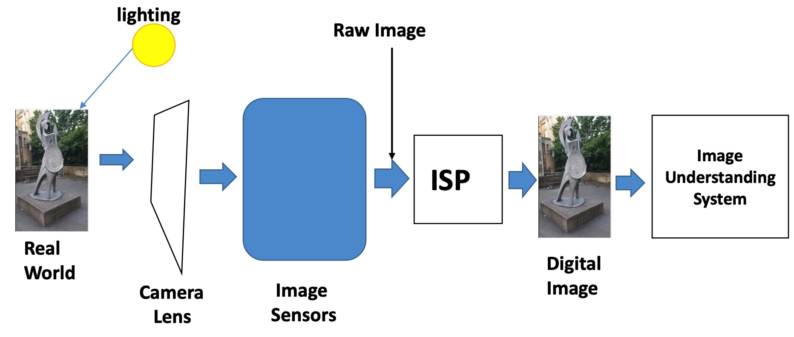
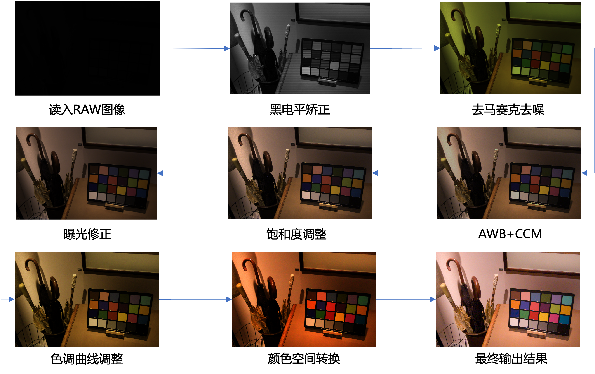

# ISP-tools

​	图像信号处理（Image Signal Process, ISP）芯片的仿真系统，实现了原始RAW数据到最终sRGB图像的渲染。

​	现有的isp研究对科研人员不友好，一般实验室也没有芯片公司的软硬件环境。多阶段ISP的每个阶段通常含有基于传统和深度学习的多种算法，每个模块的中间结果无法获得；现有人员提出了基于深度学习的端到端ISP，一步渲染。ISP的不同模式、算法和组合都会影响图像质量，然而目前也缺乏一个统一评测平台。

​	针对上述问题，我们用Python实现了ISP芯片的仿真系统，为使用开发ISP算法提供便利的实验环境。

## 演示demo

./images/ISP系统demo.mp4

## 软件架构

* 提供了一套标准的图像信号处理流程

* 提供了一些ISP的传统算法和AI算法

* 提供了一个模型可对比、参数可选择的综合性系统

## 主要功能

1. 多阶段ISP(传统算法和AI-子环节)：渲染，中间阶段的效果输出……

   

2. 端到端AI- ISP渲染

3. 指标评估

4. 单图像处理和批量处理

# 主要环境和库

* Python 3.8
* cuda 10.0
* PyQt5 5.1
* torch 1.8.1
* torchvision 0.9.1

……

## 最后

由于实验室要求保密，目前代码暂时无法释放，先放个演示，后续再议……

